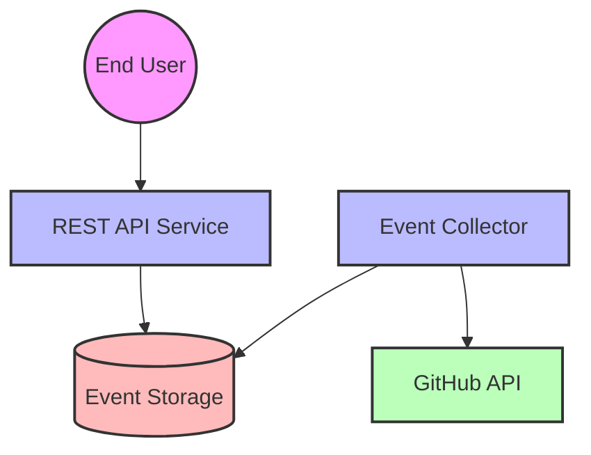

# GitHub Events Monitor

A Python-based service that monitors GitHub events and provides metrics via a REST API.

## Features

- Real-time monitoring of GitHub events (WatchEvent, PullRequestEvent, IssuesEvent)
- REST API endpoints for metrics:
  - Average time between pull requests for a repository
  - Event counts by type with time-based filtering
  - Visual representation of PR intervals
- Rate limit handling for GitHub API
- Efficient event storage and deduplication
- Beautiful visualization of PR metrics

## Architecture (C4 Level 1)



## Setup

1. Clone the repository:
```bash
git clone <repository-url>
cd github-events-monitor
```

2. Create and activate a virtual environment:
```bash
python -m venv .venv
source .venv/bin/activate  # On Windows: .venv\Scripts\activate
```

3. Install dependencies:
```bash
pip install -r requirements.txt
```

4. Set up environment variables:
```bash
# Create .env file
GITHUB_TOKEN=your_github_token  # Optional but recommended
POLL_INTERVAL=60  # Seconds between GitHub API polls
```

5. Run the service:
```bash
uvicorn app.api:app --reload
```

## API Endpoints

### 1. Average PR Interval
```
GET /metrics/{owner}/{repo}/avg-pr-interval
```
Returns the average time between pull requests for a repository.

### 2. Event Counts
```
GET /metrics/{owner}/{repo}/event-counts?offset=10
```
Returns event counts by type for the last `offset` minutes.

### 3. PR Interval Visualization
```
GET /viz/{owner}/{repo}/pr-intervals.png?days=10
```
Returns a PNG visualization of PR intervals over the specified number of days.

## Implementation Details

### Event Collection
- Background task polls GitHub's public events API every 60 seconds
- Filters for WatchEvent, PullRequestEvent, and IssuesEvent
- Handles rate limiting using GitHub API headers
- Deduplicates events using event IDs

### Storage
- Events are stored with repository and timestamp information
- Efficient querying for specific repositories and time ranges
- Automatic cleanup of old events

### Visualization
- Two-panel visualization for PR metrics:
  1. PR creation timeline (scatter plot)
  2. PR interval distribution with mean and median lines

## Development

### Running Tests
```bash
pytest
```

### Code Style
The project follows PEP 8 guidelines. Use flake8 for linting:
```bash
flake8 app
```

## Assumptions

1. GitHub API Availability:
   - The service assumes the GitHub API is generally available
   - Rate limiting is handled gracefully

2. Data Retention:
   - Events are stored indefinitely (implement cleanup if needed)
   - Duplicate events are filtered using event IDs

3. Time Zones:
   - All timestamps are stored and processed in UTC
   - API responses maintain UTC timestamps

4. Performance:
   - The service is designed for moderate load
   - Event collection runs every 60 seconds
   - Visualization is generated on-demand

## Future Improvements

1. Add authentication for API endpoints
2. Implement event data persistence
3. Add more metrics and visualizations
4. Add monitoring and alerting
5. Implement data retention policies
6. Add caching for frequently accessed metrics